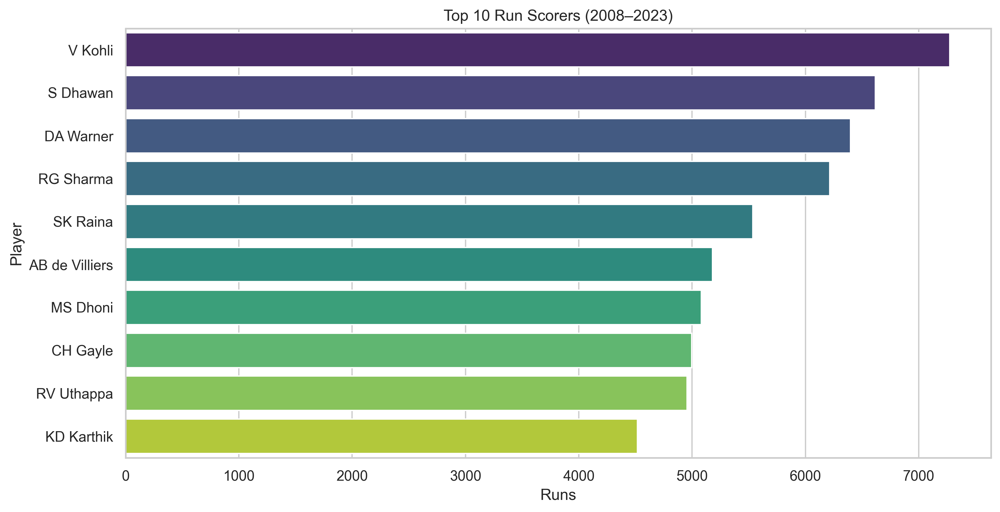
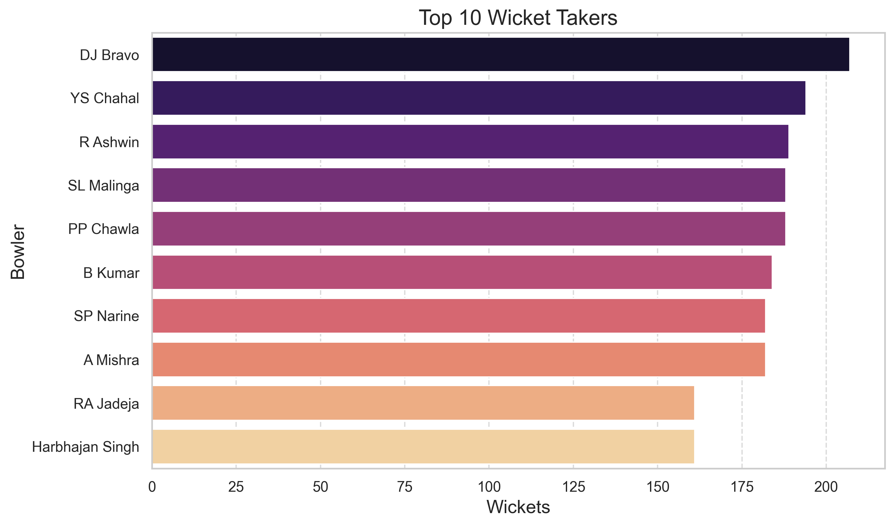
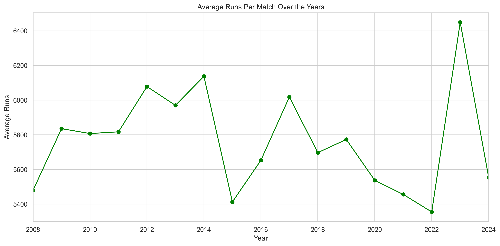
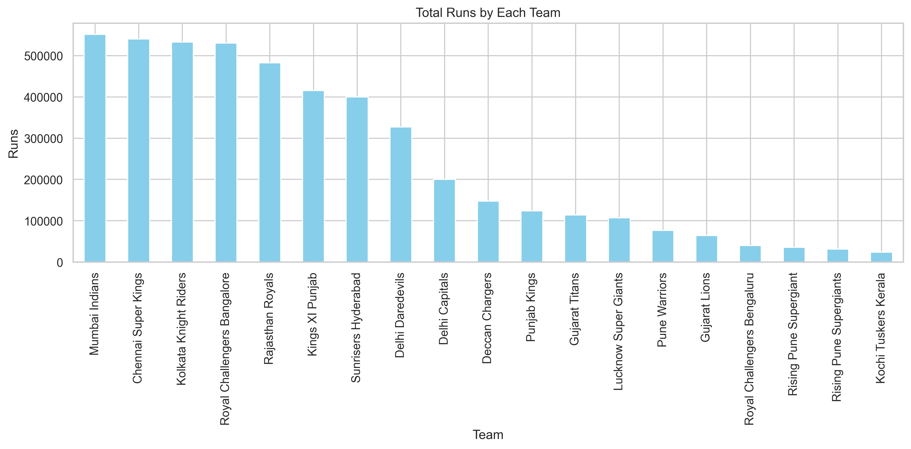

# IPL Data Analysis Till 2024 📊🏏

This project explores the Indian Premier League (IPL) datasets from 2008 to 2024 using Python. It includes insights on player performance, match outcomes, scoring trends, powerplay analysis, and more.

---

## 📁 Datasets Used

- [IPL.zip](./IPL.zip) — Ball-by-ball data from 2008 to 2023  
- [players_performace_2008_2023.csv](./players_performace_2008_2023.csv) — Player-wise performance summary (batting & bowling)  
- [IPL24_All_Matches_Dataset.xlsx](./IPL24_All_Matches_Dataset.xlsx) — IPL 2024 match data (ball-level)

---

## 📌 Key Insights

- 🏏 Top batsmen & bowlers across seasons  
- 📈 Scoring trends and run rate analysis  
- 🎯 Powerplay performance of teams  
- 🪙 Toss decision vs match results  
- 🧠 Match win/loss patterns across years  
- 🔍 Deep-dive into IPL 2024 season  

---

## 📄 Report

A PDF summary report was generated to showcase analysis and placeholder visuals:

**👉 [Download IPL_Analysis_Report.pdf](IPL_Analysis_Report.pdf)**

---

## 🛠️ Tools & Technologies

- Python  
- Pandas  
- NumPy  
- Matplotlib  
- Seaborn  
- Jupyter Notebook  

---

## 📷 Sample Visuals

### 🔹 Top 10 Run Scorers (2008–2023)


### 🔹 Top 10 Wicket Takers (2008–2023)


### 🔹 Average Run Over the Years


### 🔹 Total Runs by Each Team


### 🔹 Teams by Number of Wins (2008–2023)
.png)


---

## 🚀 How to Run

1. Clone the repository:
   ```bash
   git clone https://github.com/yourusername/IPL_DataAnalysis_Till2024.git
   cd IPL_DataAnalysis_Till2024

2. Install required libraries:
   pip install pandas matplotlib seaborn openpyxl
   
3. Launch the notebook:
   jupyter notebook

4. Open and run IPL_Analysis.ipynb

## 👨‍💻 Author

Rohit Kumar Rai  
📧 Email: [er.rohitrai87@gmail.com](mailto:er.rohitrai87@gmail.com)  
🔗 LinkedIn: [linkedin.com/in/rohit-kumar-rai-04dec](https://www.linkedin.com/in/rohit-kumar-rai-04dec)  
🎓 Education: B.Tech in Computer Science Engineering | MBA in Business Analytics

